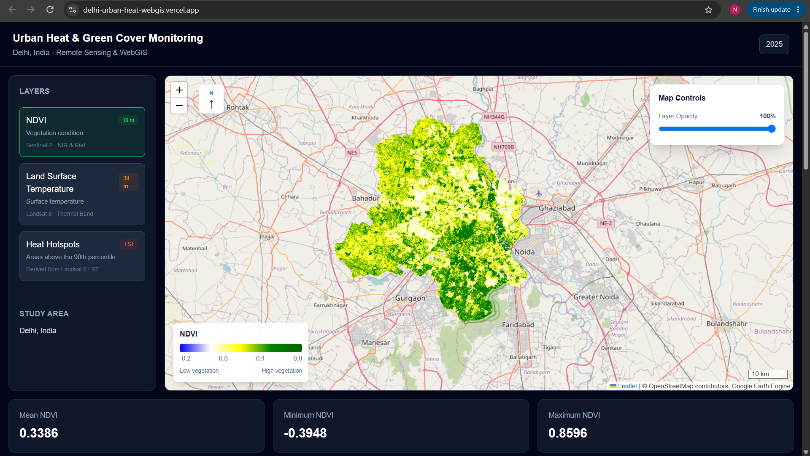
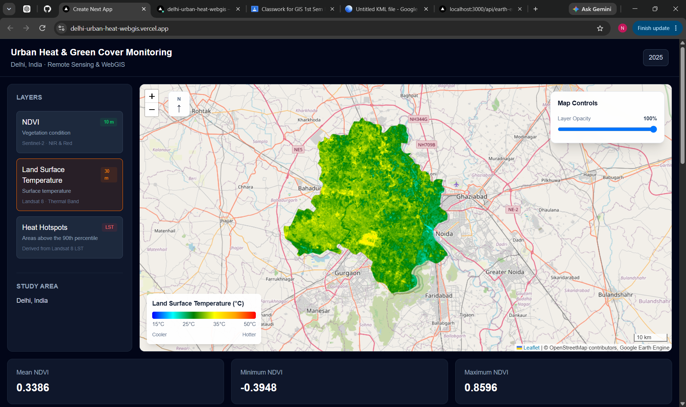
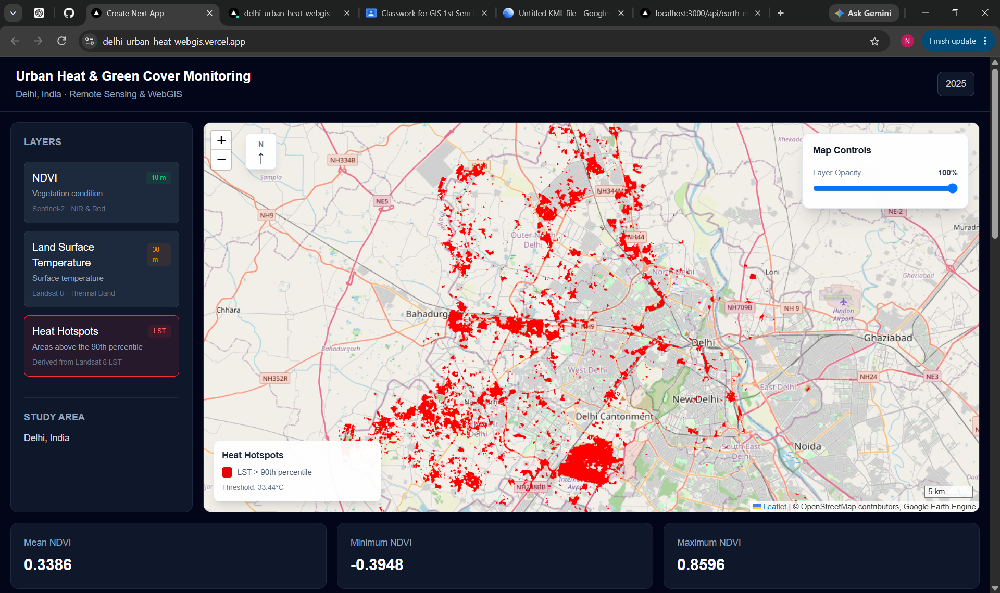
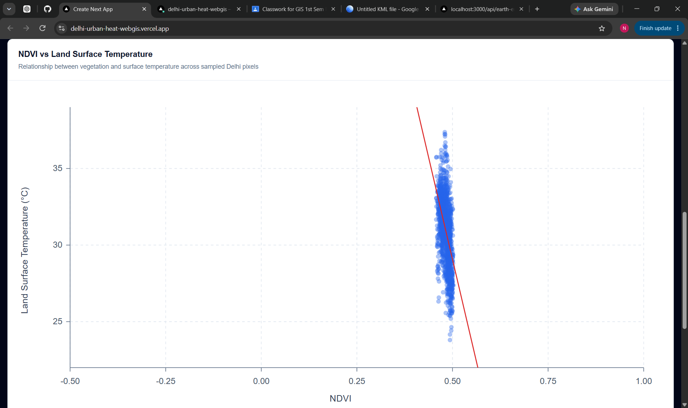
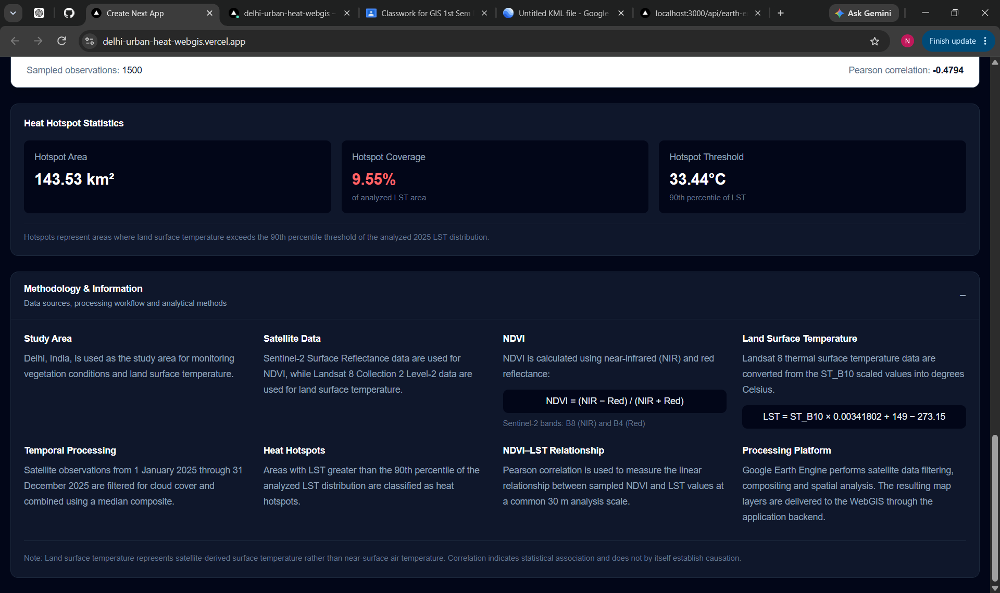

# 🌡️ Urban Heat & Green Cover Monitoring WebGIS

An interactive **WebGIS for monitoring vegetation, land surface temperature, and urban heat hotspots across Delhi, India** using satellite remote sensing and Google Earth Engine.

The application integrates **Sentinel-2 NDVI** and **Landsat 8 Land Surface Temperature (LST)** with interactive mapping and spatial-statistical analysis to explore the relationship between vegetation and surface temperature.

<p align="center">
  <a href="https://delhi-urban-heat-webgis.vercel.app/">
    <strong>🚀 Open Live WebGIS</strong>
  </a>
</p>

<p align="center">
  
  
  
  
  
</p>
---

## 🌐 Live Demo

### 🚀 [Delhi Urban Heat & Green Cover Monitoring WebGIS](https://delhi-urban-heat-webgis.vercel.app/)

Explore the deployed application:

* Interactive satellite-derived environmental layers
* NDVI vegetation analysis
* Land Surface Temperature analysis
* Dynamic heat hotspot detection
* NDVI–LST correlation
* Interactive scatter plot
* Remote-sensing methodology

---

# 📸 Application Preview

## 🟢 NDVI — Vegetation Condition



The NDVI layer represents vegetation conditions across Delhi using Sentinel-2 Surface Reflectance imagery.

**Spatial resolution:** 10 m

---

## 🌡️ LST — Land Surface Temperature



The LST layer represents satellite-derived land surface temperature obtained from Landsat 8 thermal observations.

**Spatial resolution:** 30 m

---

## 🔥 Urban Heat Hotspots



Heat hotspots are dynamically identified using the **90th percentile of the analyzed LST distribution**.

Rather than relying on a fixed temperature threshold, the hotspot threshold adapts to the temperature distribution of the study area.

---

## 📈 NDVI–LST Relationship



The application samples NDVI and LST observations and visualizes their relationship through a scatter plot and linear regression.

The Pearson correlation coefficient is calculated dynamically from the satellite-derived datasets.

A negative correlation indicates an inverse statistical association between vegetation and surface temperature within the analyzed dataset.

> Correlation indicates statistical association and should not be interpreted as proof of causation.

---

## 📖 Methodology & Information



The application includes an integrated methodology panel describing the satellite datasets, processing workflow, indices, temperature derivation, hotspot detection, and analytical approach.

---

# 🎯 Project Objectives

The project was developed to demonstrate how **Remote Sensing, GIS, WebGIS, and modern web technologies** can be integrated for urban environmental monitoring.

### Main objectives

1. Generate an **NDVI layer** using Sentinel-2 satellite imagery.
2. Generate **Land Surface Temperature** using Landsat 8 thermal data.
3. Analyze the relationship between vegetation and surface temperature.
4. Identify relatively high-temperature urban hotspot areas.
5. Develop an interactive WebGIS for visualizing and exploring the results.

---

# ✨ Key Features

### 🟢 NDVI Mapping

Vegetation conditions are mapped using the **Normalized Difference Vegetation Index**.

For Sentinel-2:

```text
NDVI = (B8 - B4) / (B8 + B4)
```

Where:

* **B8** = Near Infrared (NIR)
* **B4** = Red

The resulting NDVI layer has a spatial resolution of **10 m**.

---

### 🌡️ Land Surface Temperature

Land Surface Temperature is derived from the Landsat 8 Collection 2 Level-2 thermal surface temperature product.

The application uses:

```text
ST_B10
```

and converts the scaled temperature values from Kelvin to Celsius:

```text
LST = ST_B10 × 0.00341802 + 149.0 − 273.15
```

The resulting LST layer has a spatial resolution of **30 m**.

---

### 🔥 Dynamic Heat Hotspots

The hotspot layer is generated using the **90th percentile** of the LST distribution.

Conceptually:

```text
Hotspot = LST > 90th percentile
```

This makes the hotspot threshold **data-driven rather than manually fixed**.

---

### 📊 Dynamic Statistics

The dashboard dynamically calculates environmental statistics including:

#### NDVI

* Mean
* Minimum
* Maximum

#### LST

* Mean
* Minimum
* Maximum

#### Heat Hotspots

* Temperature threshold
* Hotspot area
* Hotspot percentage

The values are calculated from the Earth Engine datasets and are not hard-coded into the interface.

---

### 📈 NDVI–LST Correlation

The application calculates the **Pearson correlation coefficient** between NDVI and LST.

Because the two datasets have different spatial resolutions:

```text
Sentinel-2 NDVI → 10 m
Landsat 8 LST   → 30 m
```

NDVI is resampled to the LST spatial resolution before the correlation analysis.

The resulting observations are also used to generate the NDVI–LST scatter plot.

---

### 🗺️ Interactive WebGIS

The map interface provides:

* Interactive pan and zoom
* NDVI layer
* LST layer
* Heat hotspot layer
* Layer opacity control
* Dynamic legends
* Scale bar
* North arrow
* Active-layer indication

---

# 🛰️ Remote Sensing Datasets

| Dataset                        | Application | Resolution |
| ------------------------------ | ----------- | ---------: |
| Sentinel-2 Surface Reflectance | NDVI        |       10 m |
| Landsat 8 Collection 2 Level-2 | LST         |       30 m |

### Sentinel-2

Google Earth Engine collection:

```text
COPERNICUS/S2_SR_HARMONIZED
```

### Landsat 8

Google Earth Engine collection:

```text
LANDSAT/LC08/C02/T1_L2
```

---

# 📅 Temporal Scope

The current implementation uses satellite observations from:

```text
January 1, 2025 → January 1, 2026
```

The application therefore represents a **2025 annual baseline analysis** rather than a single-day observation.

Satellite imagery is filtered and composited within this analysis period.

---

# 🧮 Processing Workflow

```text
                 Delhi Study Area
                        │
                        ▼
              Google Earth Engine
                        │
          ┌─────────────┴─────────────┐
          │                           │
          ▼                           ▼
     Sentinel-2                    Landsat 8
          │                           │
          ▼                           ▼
      Cloud Masking              L2 Processing
          │                           │
          ▼                           ▼
       NDVI (10 m)                LST (30 m)
          │                           │
          └─────────────┬─────────────┘
                        │
                        ▼
              Statistical Analysis
                        │
          ┌─────────────┼─────────────┐
          │             │             │
          ▼             ▼             ▼
       Statistics   NDVI–LST      90th Percentile
                    Correlation       Hotspots
          │             │             │
          └─────────────┼─────────────┘
                        ▼
                  Next.js APIs
                        │
                        ▼
                  React WebGIS
                        │
                        ▼
                  Leaflet Map
```

---

# 🔬 Methodology

## 1. Study Area

The study area is the administrative boundary of **Delhi, India**.

The boundary is obtained from the Google Earth Engine administrative boundary dataset:

```text
FAO/GAUL/2015/level1
```

---

## 2. Sentinel-2 Processing

Sentinel-2 Surface Reflectance imagery is filtered by:

* Delhi study area
* Analysis period
* Cloud percentage

Cloud and cirrus pixels are masked using the **QA60** quality band.

Reflectance values are scaled before NDVI calculation.

A median composite is generated and clipped to the Delhi boundary.

---

## 3. NDVI Calculation

NDVI is calculated using the NIR and Red bands:

```text
NDVI = (NIR - Red) / (NIR + Red)
```

For Sentinel-2:

```text
NDVI = (B8 - B4) / (B8 + B4)
```

---

## 4. Landsat 8 Processing

Landsat 8 Collection 2 Level-2 imagery is filtered using:

* Delhi study area
* Analysis period
* Cloud percentage

The surface temperature band is converted to degrees Celsius using the dataset scaling parameters.

A median composite is then generated for the analysis period.

---

## 5. Heat Hotspot Detection

The LST distribution is analyzed to calculate its **90th percentile**.

Pixels above the resulting threshold are classified as relatively hotter areas.

```text
LST > P90
```

The application then calculates the corresponding hotspot area and percentage.

---

## 6. NDVI–LST Relationship

NDVI is available at 10 m while LST is available at 30 m.

To make the datasets spatially comparable, NDVI is resampled to the 30 m LST spatial scale.

Pearson correlation is then calculated between the two variables.

A sample of observations is also used for the dashboard scatter plot and regression analysis.

---

# 🏗️ System Architecture

```text
┌───────────────────────────────────────────────┐
│              Satellite Data                   │
│                                               │
│  Sentinel-2                    Landsat 8      │
│      │                             │           │
│      ▼                             ▼           │
│    NDVI                           LST          │
└──────────────┬──────────────────────┬─────────┘
               │                      │
               └──────────┬───────────┘
                          ▼
                Google Earth Engine
                          │
              ┌───────────┼───────────┐
              │           │           │
              ▼           ▼           ▼
         Statistics   Correlation  Hotspots
              │           │           │
              └───────────┼───────────┘
                          ▼
                  Next.js API Routes
                          │
                          ▼
                    React Frontend
                          │
                          ▼
                    Leaflet WebGIS
```

---

# 💻 Technology Stack

## Frontend

* **Next.js**
* **React**
* **TypeScript**
* **Tailwind CSS**
* **React Leaflet**
* Native SVG visualization

## Geospatial Processing

* **Google Earth Engine**
* Sentinel-2
* Landsat 8
* NDVI
* Land Surface Temperature
* Raster statistics
* Spatial resampling
* Pearson correlation

## Mapping

* **Leaflet**
* **OpenStreetMap**

## Backend

* Next.js API Routes
* Google Earth Engine REST API
* Google Earth Engine authentication

## Deployment

* **GitHub**
* **Vercel**

---

# 📁 Project Structure

```text
delhi-urban-heat-webgis/
│
├── public/
│   └── screenshots/
│       ├── ndvi-dashboard.png
│       ├── lst-dashboard.png
│       ├── heat-hotspots.png
│       ├── ndvi-lst-scatter.png
│       └── methodology.png
│
├── src/
│   ├── app/
│   │   ├── api/
│   │   │   └── earth-engine/
│   │   │       ├── correlation/
│   │   │       ├── hotspot-stats/
│   │   │       ├── hotspots/
│   │   │       ├── lst/
│   │   │       ├── lst-stats/
│   │   │       ├── ndvi/
│   │   │       ├── ndvi-lst-samples/
│   │   │       ├── ndvi-stats/
│   │   │       └── serialize/
│   │   │
│   │   └── page.tsx
│   │
│   ├── components/
│   │   ├── Map.tsx
│   │   ├── MapWrapper.tsx
│   │   ├── NDVILSTScatterPlot.tsx
│   │   ├── MethodologyPanel.tsx
│   │   └── ...
│   │
│   └── lib/
│       ├── earthEngine.ts
│       └── earthEngineRest.ts
│
├── .gitignore
├── package.json
├── tsconfig.json
└── README.md
```

---

# 🚀 Local Development

## Prerequisites

* Node.js
* npm
* Google Earth Engine project
* Earth Engine service account with appropriate permissions

---

## Installation

Clone the repository:

```bash
git clone https://github.com/NeerajKumarcodes/delhi-urban-heat-webgis.git
```

Navigate to the project:

```bash
cd delhi-urban-heat-webgis
```

Install dependencies:

```bash
npm install
```

---

## Earth Engine Credentials

For local development, the application can use a service-account credential file:

```text
earth-engine-key.json
```

The file is intentionally excluded from version control.

For deployment, credentials are provided through the server-side environment variable:

```text
EARTH_ENGINE_SERVICE_ACCOUNT_KEY
```

The private key must **never** be committed to the public repository.

---

## Run Development Server

```bash
npm run dev
```

Then open:

```text
http://localhost:3000
```

---

## Production Build

```bash
npm run build
```

---

# 🔐 Security

Earth Engine service-account credentials are not stored in the public repository.

The local credential file:

```text
earth-engine-key.json
```

is excluded through `.gitignore`.

Production credentials are supplied through:

```text
EARTH_ENGINE_SERVICE_ACCOUNT_KEY
```

The credentials are handled server-side by the application's API layer rather than being exposed directly to the client.

> **Never publish or commit the Earth Engine service-account private key.**

---

# 📊 Current Baseline Analysis

The current 2025 baseline dynamically produces:

| Analysis         | Output                                     |
| ---------------- | ------------------------------------------ |
| NDVI             | Mean, minimum, maximum                     |
| LST              | Mean, minimum, maximum                     |
| Heat hotspots    | P90 threshold, area, percentage            |
| NDVI–LST         | Pearson correlation                        |
| Scatter analysis | Sampled NDVI/LST observations + regression |

The dashboard retrieves these analytical outputs dynamically from Google Earth Engine.

---

# 🧠 Scientific Interpretation

The project demonstrates the integration of vegetation and thermal remote sensing data for urban environmental analysis.

Vegetation can influence surface thermal conditions through mechanisms such as **evapotranspiration and shading**. However, the statistical relationship observed in this application should not be interpreted as direct evidence of causation.

Land surface temperature is also influenced by factors including:

* Built-up density
* Land-cover characteristics
* Soil moisture
* Water bodies
* Atmospheric conditions
* Urban morphology
* Anthropogenic heat

Therefore, the NDVI–LST relationship should be interpreted within the context of the selected study period, datasets, spatial resolution, and processing methodology.

---

# 🔮 Future Enhancements

Potential future development includes:

* Multi-year NDVI and LST analysis
* Seasonal comparisons
* Time-series visualization
* Land-use/Land-cover integration
* Built-up index analysis
* Population exposure analysis
* Ward-level statistics
* Heat vulnerability assessment
* Temporal hotspot comparison
* Time-series animation
* Downloadable analytical reports
* Additional satellite datasets
* Advanced spatial statistics

---

# 📚 Concepts Demonstrated

This project brings together concepts from:

* Remote Sensing
* Geographic Information Systems
* WebGIS
* Earth Observation
* Google Earth Engine
* Satellite Image Processing
* NDVI Analysis
* Land Surface Temperature
* Spatial Statistics
* Environmental Monitoring
* Full-Stack Web Development

---

# 👨‍💻 Author

## Neeraj Kumar

**M.Tech Geoinformatics**
Delhi Technological University

**B.Tech Metallurgical and Materials Engineering**
NIT Rourkela

### Areas of Interest

* Geoinformatics
* Remote Sensing
* GIS & WebGIS
* Earth Observation
* Geospatial Data Analysis
* Full-Stack Development
* AI & Geospatial Applications

---

## 🔗 Links

🌐 **Live Application:**
https://delhi-urban-heat-webgis.vercel.app/

💻 **GitHub Repository:**
https://github.com/NeerajKumarcodes/delhi-urban-heat-webgis

---

## ⭐ Support

If this project is useful for learning about **Remote Sensing, GIS, WebGIS, or Google Earth Engine**, consider giving the repository a ⭐.
